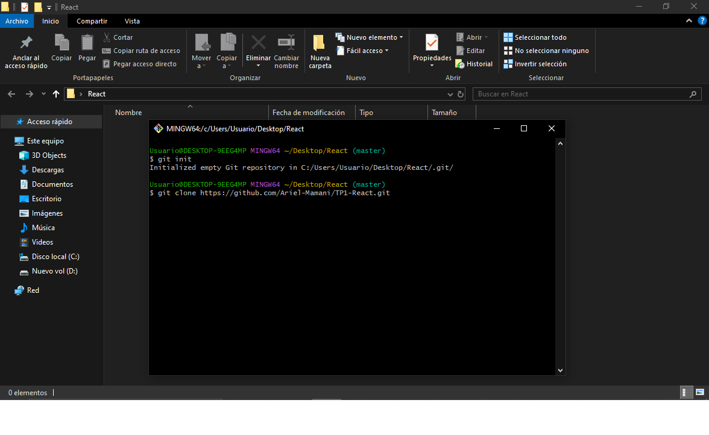
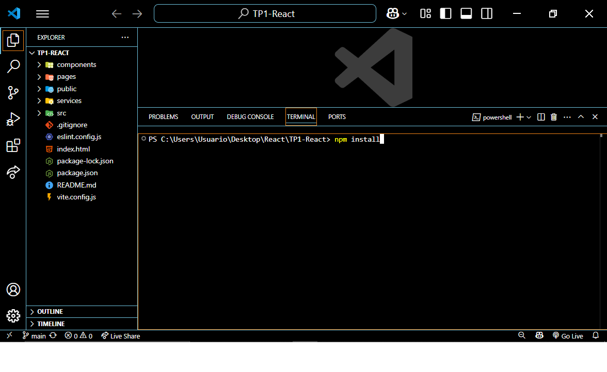
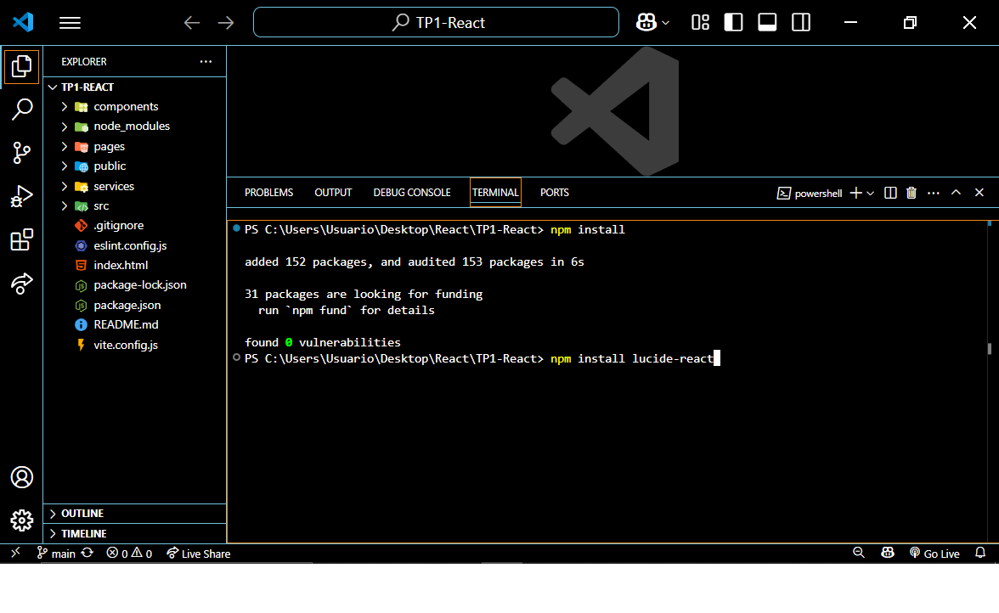
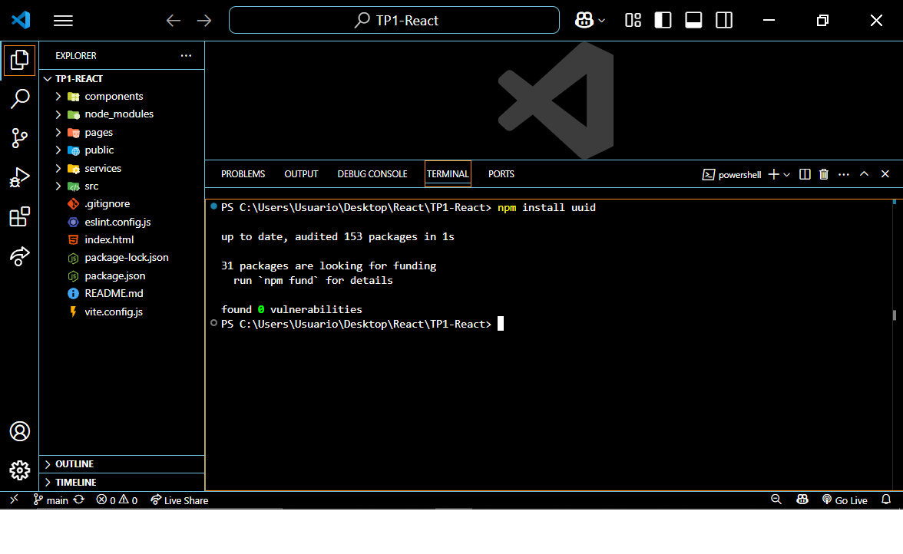
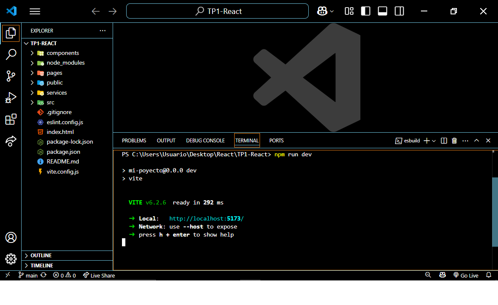
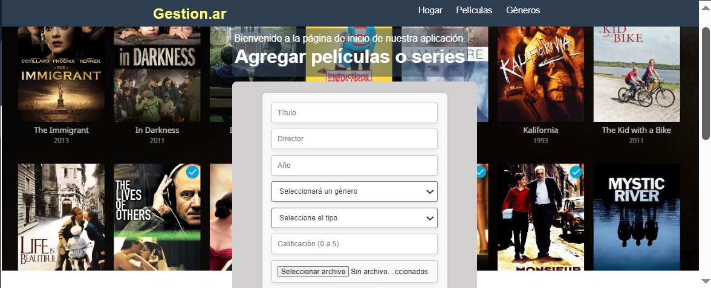

# Trabajo Práctico: REACT

## integrantes: 
- **Ariel Mamani** FAI-3607
- **Diego Marchandon** FAI-4886
- **Ignacio Araya** FAI-836

## Instrucciones:
El sistema puede ser corrido directamente desde la aplicación Vercel a travez del siguiente link:
 - https://tp-1-react-o9qx.vercel.app/ 

Para ejecutarlo de manera local es necesario clonar el proyecto e instalar las dependencias:
<h3>Instalación paso por paso</h3>
<ol>
    <li>
        Para instalar la aplicación nos posicionamos con una terminal en la carpeta donde queremos descargarla y ejecutamos el siguiente comando:
        git clone https://github.com/Ariel-Mamani/TP1-React.git
        
    </li>
    <li>
        Una vez clonado nos posisionamos en la carpeta del proyrcto(TP1-React), abrimos el terminal y usamos el comando <strong>npm install</strong>
        
    </li>
    <li>
        Tambien debera ejecutar los siguientes comandos que son para instalar las librerias que usamos:
        <li>Libreria de Iconos Lucide: usamos el comando <strong>npm install lucide-react</strong>
        
        </li>
        <li>Libreria para crear Ids unicos(uuid): ingresamos el comando <strong>npm instal uuid</strong>
        </li>
    </li>
    <li>
        Después de que todo se instala usamos el comando <strong>npm run dev</strong>
        
    </li>
    <li>
        Y finalmente se abre la app en el navegador predeterminado
        
    </li>
</ol>

## Descripción del proyecto: 
Construir en React una aplicación que funcione como gestor personal de películas y series.
La aplicación debe permitir al usuario agregar nuevas películas o series, marcarlas como 
vistas, editarlas y eliminarlas (con confirmación). 
Cada ítem debe tener título, director, año, género (usar un select para este campo), rating y 
tipo (película o serie). 
La aplicación debe mostrar dos listas: una con contenido por ver y otra con contenido visto.

>*a. En el archivo readme.md:*  
>*Explicar la función de los siguientes archivos iniciales: index.js,*
>*App.js, index.css y package-json.js.*
1. **index.js:**
Punto de entrada de nuestra aplicación, en donde se renderiza el componente principal `<App/>` dentro del elemento raíz `

`.
2. **App.js:**
Componente principal de la aplicación. Actúa como un contenedor que puede tener otros componentes (como el Navbar, rutas, Footer, etc).Donde indicamos los componentes y definimos la lógica principal de nuestra aplicación.
3. **index-css:** 
Archivo de estilos globales de la aplicación. Se suele importar a index.js para aplicar estilos que afectan a toda la app.
4. **package.json:**
es el archivo de configuración del proyecto. Contiene metadatos como su nombre, versión, dependencias y scripts(como start, build, deploy), versión del proyecto y más.
Es fundamental para que npm sepa cómo manejar la aplicación. 

